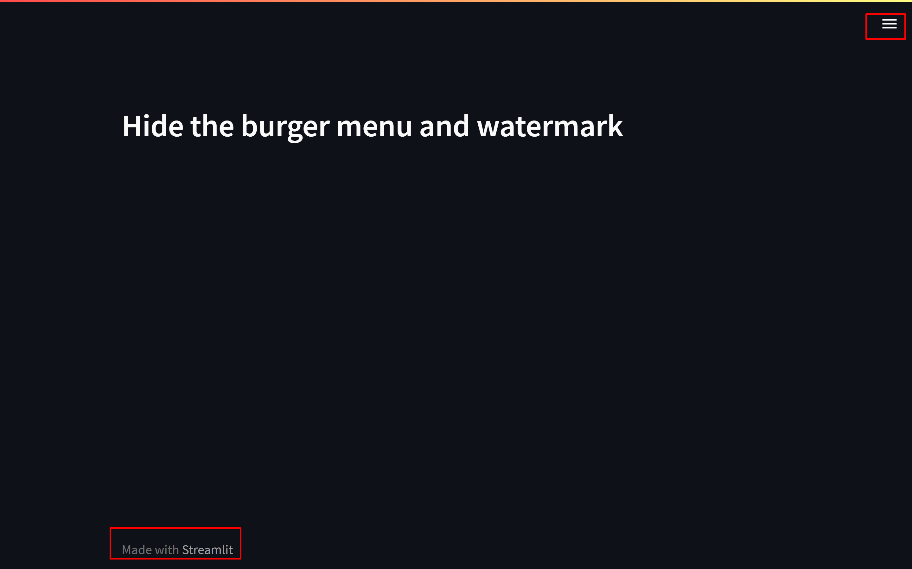
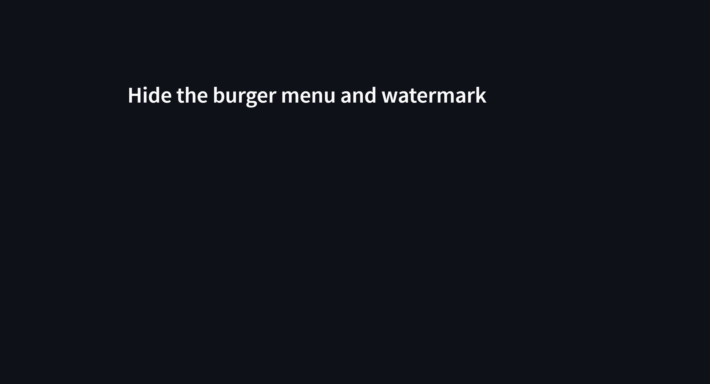

# Hide The Burger Menu and ```made with streamlit``` Watermark

## Short Explanation
The code will hide the burger menu at the top-right of the web-page where user used to control the streamlit app, and also hide the ```made with streamlit``` watermark at the bottom of the web-page.

## Before:

## After:
